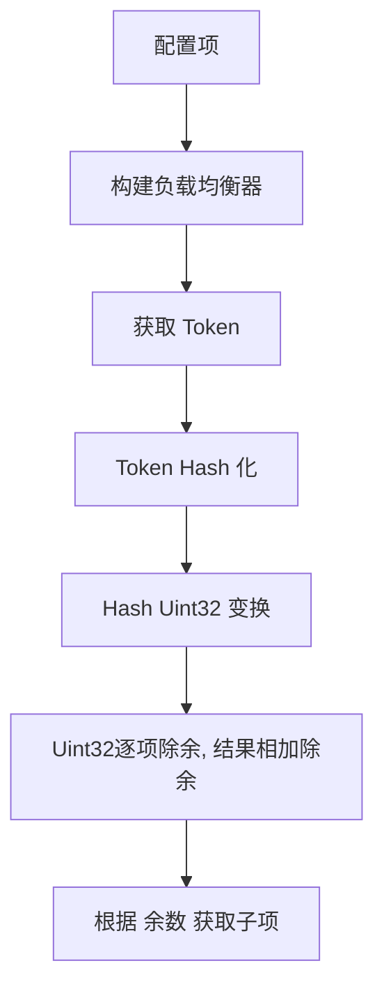

# 负载均衡器

```mermaid
graph TD
    A[配置项] --> B[构建负载均衡器]
    B --> Token[获取 Token]
    Token --> Hash[Token Hash 化]
    Hash --> Binary[Hash Uint32 变换]
    Binary --> Subset[Uint32逐项除余, 结果相加除余]
    Subset --> C[根据 余数 获取子项]
```